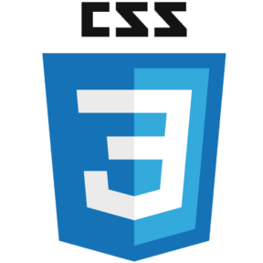

## Hello, my name is Alexandr Sidorov
# I'am a Web developer
🏆 Stack:
Sass.png JS.png TypeScript.png React.png Angular.svg webpack.png vite.svg

🔨 Tools:
prettier.png markdown.png

👓 New things I'm about to learn:
NextJS.png

📞 Connect with me:
HTML.png HTML.png